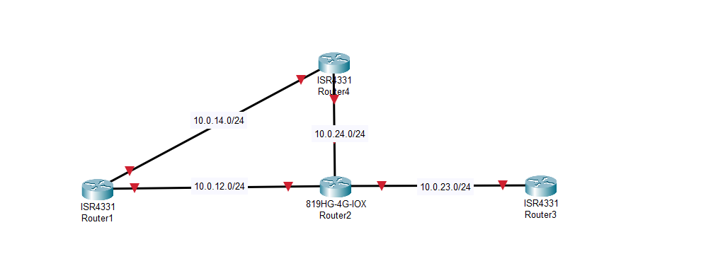

```markdown
# 🛠️ Topologia de Rede Utilizada
```
---
## 🗺️ Topologia da Rede

A topologia da rede foi projetada com **quatro roteadores** conectados em um formato parcialmente triangular, formando dois caminhos possíveis entre R1 e R3. A comunicação entre os roteadores é feita pelas seguintes sub-redes:

- `R1 <-> R2`: 10.0.12.0/24  
- `R2 <-> R3`: 10.0.23.0/24  
- `R1 <-> R4`: 10.0.14.0/24  
- `R2 <-> R4`: 10.0.24.0/24

Essa estrutura possibilita a análise de rotas alternativas e reconvergência em caso de falha de link. O teste de protocolos de roteamento como OSPF e RIP foi conduzido com foco na capacidade de convergência e performance frente a falhas simuladas.

## 📷 Topologia Visual


